# BootCamp_sqlalchemy-challenge

## Precipitation Analysis

1. Find the most recent date in the dataset.
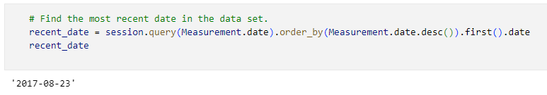

2. Using that date, get the previous 12 months of precipitation data by querying the previous 12 months of data.

3. Select only the "date" and "prcp" values

4. Load the query results into a Pandas DataFrame. Explicitly set the column names.

5. Sort the DataFrame values by "date".

6. Plot the results by using the DataFrame plot method.
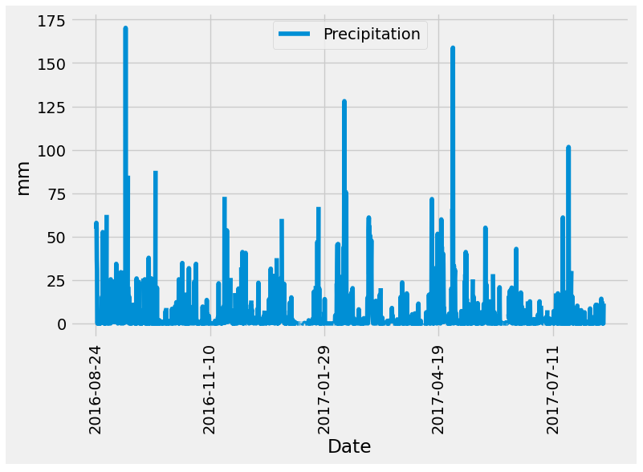

7. Use Pandas to print the summary statistics for the precipitation data.
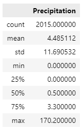

## Station Analysis

1. Design a query to calculate the total number of stations in the dataset.
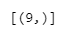

2. Design a query to find the most-active stations (that is, the stations that have the most rows)
   * List the stations and observation counts in descending order.
   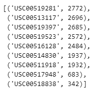

   * Answer the following question: which station id has the greatest number of observations?
   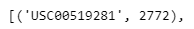

   * Using the most-active station id, calculate the lowest, highest, and average temperatures.
   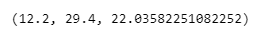

3. Design a query to get the previous 12 months of temperature observation (TOBS) data.
   * Filter by the station that has the greatest number of observations.
   * Query the previous 12 months of TOBS data for that station
   * Plot the results as a histogram with bins=12
   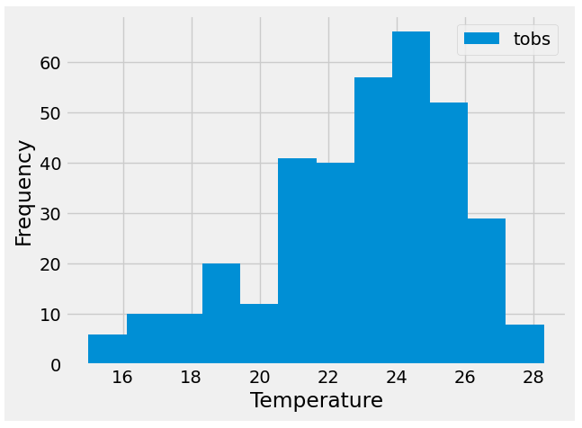

## Design Your Climate App
1. Home Page
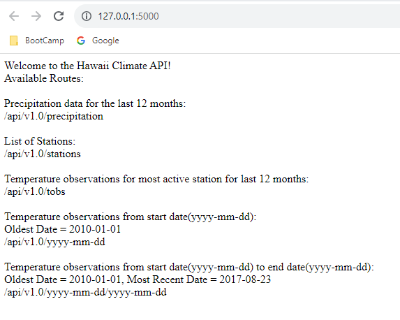

2. Precipitation Page
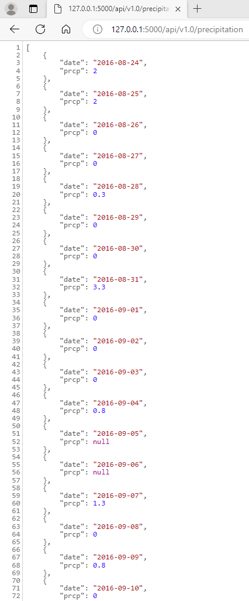

3. Stations Page
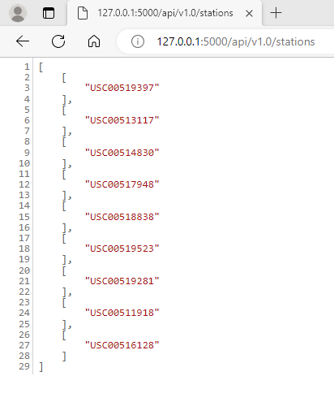

4. Tobs Page
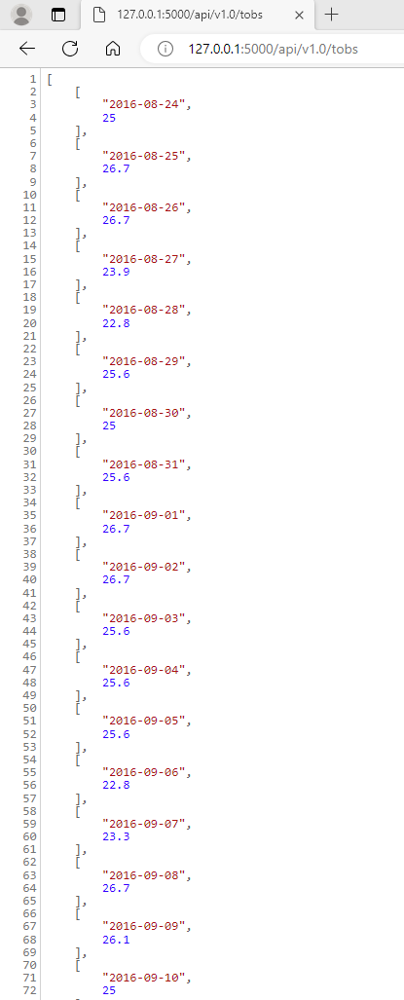

5. Start Date plus Start and End Date Pages
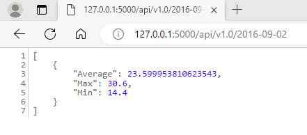
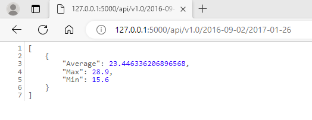

